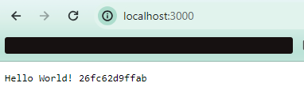
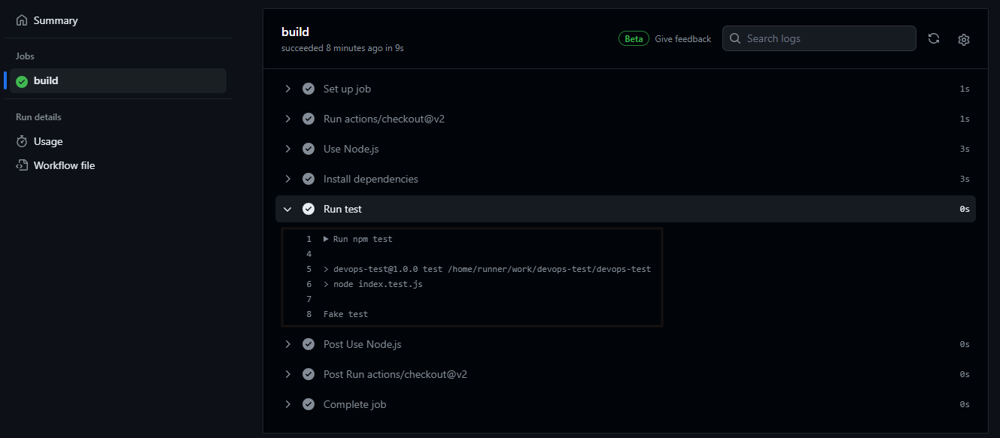

# Teste
Realização de um teste para vaga de DevOps

## Passos

- Primeiro criei um repositório público para o teste.
- Testei a app localmente na porta 3000 para a criação do Dockerfile (teste do app ok)

- Inicio da criação de um workflow no GitHub (Action) para teste da app. 

- Criado step para build da imagem e envio para o dockerhub.
- Tentativa de criação de um cloud run + cloud build, porém não consegui fazer o funcionamento no momento de um novo push na main, mas a aplicação de forma manual está rodando nessa URL, utilizando o cloud run <https://devops-test-qpnkd7xoka-uc.a.run.app/>
- Não consegui realizar um CD para entrega automática da imagem que está no dockerhub, mas descobri que é possível criar uma instância a partir de uma imagem do DockerHub, com isso irei preparar o arquivo de terraform já provisionando uma instância com a imagem.
- 