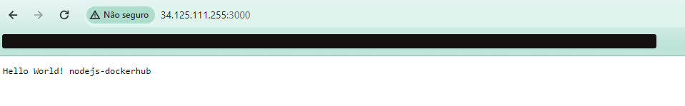

# Teste
Realização de um teste para vaga de DevOps

## Passos

1. Criado repositório público para o teste <https://github.com/brunohmg89/devops-test>

2. Aplicação testada em ambienete local na porta 3000 para a criação do Dockerfile.

3. Inicio da criação de um workflow no GitHub Actions para teste da app. Documentação utilizada: <https://docs.github.com/en/actions/automating-builds-and-tests/building-and-testing-nodejs>

4. Criado step para build da imagem e envio para o dockerhub. Documentação utilizada: <https://docs.github.com/en/actions/publishing-packages/publishing-docker-images>

Obs: Cada push realizado na `main` o workflow é iniciado.

5. Tentativa de criação de um cloud run + cloud build, porém não consegui fazer o funcionamento no momento de um novo push na main, mas a aplicação de forma manual está rodando nessa URL, utilizando o cloud run <https://devops-test-qpnkd7xoka-uc.a.run.app/>

6. Não consegui realizar um CD para entrega automática da imagem que está no dockerhub, mas descobri que é possível criar uma instância a partir de uma imagem do DockerHub, com isso preparei o arquivo de terraform já provisionando uma instância com a imagem.
<http://34.125.127.118:3000/>
